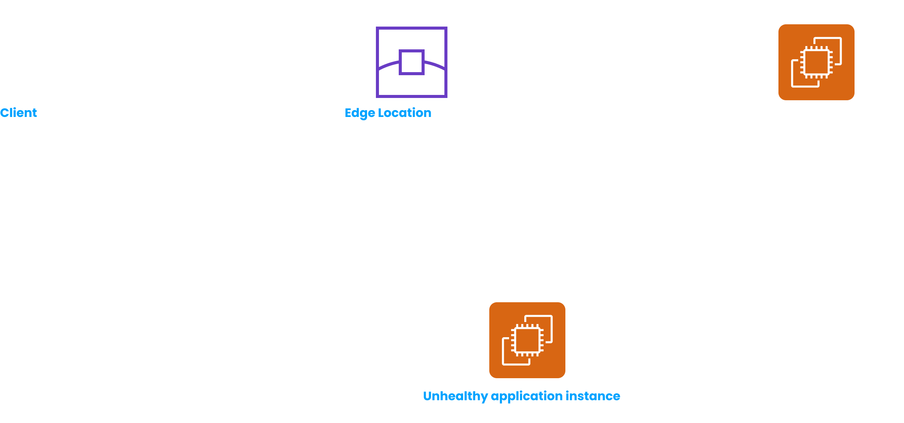

# CloudFront and AWS Global Accelerator

> **CloudFront is a Content Delivery Network (CDN) provided by AWS. It improves read performance by caching contents in edge locations and thus providing a better user experience by lowering application latency.**
> 

CloudFront has 216 edge locations across the globe. It supports multiple types of origins - S3 buckets, custom origins (any HTTP endpoint - like an EC2 instance, ALB, S3 website etc.)

<aside>
💡 You can limit access of an S3 bucket to only CloudFront by using Origin Access Policy (OAC) + required S3 bucket policies, making the S3 objects still being accessible globally.

</aside>

<aside>
💡 CloudFront with S3 should be used for static content that must be available everywhere. S3 Cross Region Replication should be used for dynamic content that needs to be available in few regions only and with low latency.

</aside>

CloudFront provides **Geo Restriction** feature which allows you to restrict access to your content based on the geographic location of the viewer. You can create whitelist / blocklist for this purpose. CloudFront uses a 3rd database to detect the country of the user using the user’s IP.

The egress cost varies across edge locations. Thats’y CloudFront provides us with 3 price classes -

- **Price Class 100** - Only edge locations which have cheapest egress costs are used.
- **Price Class 200** - This class is more expensive than the previous one and it covers more regions than the first one. If low latency is important, you should consider using this class.
- **Price Class All** - This class is the most expensive one and it covers all regions. If the content is very important and needs to be available everywhere, this is the recommended price class.

## Cache Invalidation

CloudFront automatically caches content at its edge locations to improve read performance. However, if the content is frequently updated, it becomes necessary to invalidate the cached content so that users can access the updated version. There are two ways to invalidate content in CloudFront:

- **Individual object invalidation** - This method allows you to invalidate a specific file from the CloudFront cache.
- **Invalidation by path** - This method allows you to invalidate multiple files that match a certain pattern. This can be done by specifying a path pattern that matches the files you want to invalidate.

It's important to note that invalidating cached content in CloudFront can take some time and may result in a temporary increase in latency. Additionally, there are costs associated with invalidating cached content, so it's important to carefully consider when and how often to perform invalidations.

## AWS Global Accelerator

<aside>
💡 **Anycast IP** is a network addressing and routing methodology in which a single IP address is shared by multiple servers or devices. When a client sends a request to an Anycast IP, the network routes the request to the nearest server or device that is advertising the IP address, based on the routing protocol.

</aside>

Suppose we have deployed our application in India. However, users from America and Europe may experience latency issues when accessing our application due to network traffic having to traverse the public internet before reaching India. In order to reduce this latency, we decide to deploy additional instances of the application in North America, South America, and Europe. The aim is to redirect users based on their location, so if a user is in North America, they will be directed to the closest healthy application instance in that region. To achieve this intelligent routing, we utilize AWS Global Accelerator.

> **When a user makes a request, their traffic is directed to the nearest AWS edge location using Anycast IP routing. From there, AWS Global Accelerator intelligently routes the traffic to the closest healthy application instance, taking into account factors like network health, application health, and user proximity.**
> 

