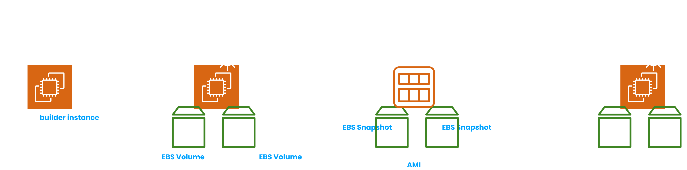

# EC2

## Elastic Block Storage (EBS)

> **An EBS Volume is a network drive that we can attach to an EC2 instance while it’s running**.
> 

Data is persisted to the EBS volume even after the EC2 instance is terminated. EBS Volumes are availability zone scoped. To 1 EC2 instance, we can attach multiple EBS volumes.

<aside>
💡 Because they are not attached physically to the EC2 instance and communicate with the instance over the network, there might be a bit of latency. But the advantage is - they can be detached and attached very quickly.

</aside>

During provisioning, we need to mention the storage and IOPS capacities for the volume. If we want, we can alter these dynamically later. After provisioning, we can leave them unattached and attach it to an EC2 instance on demand.

<aside>
💡 **Delete on Termination** - If it is enabled, then the EBS volume attached to an EC2 instance is deleted after that EC2 instance is terminated. It is enabled by default for the root EBS volume.

</aside>

There are 6 different types of EBS volumes -

- **gp2** and **gp3** - General purpose SSDs. **gp2 volumes have their IOPS linked with the disk size unlike gp3**. gp2 < gp3.
- **io1** (outdated) and **io2** - Highest performance SSDs with low latency and high throughput. They work based on the **Provisioned IOPS** model thus providing a sustained IOPS performance. These types of SSDs are generally used for database workloads. Provisioned IOPS is not linked with the disk size (like gp3 volumes).
    
    <aside>
    💡 **Multi-attach** feature - An EBS volume of type io1 / io2 can be attached to upto 16 EC2 instances (in the same Availability Zone) simultaneously. Each EC2 instance will have full read / write performance to the EBS volume.
    We must use a cluster-aware file system. Also, the applications must manage concurrent writes to the volume.
    
    </aside>
    
    <aside>
    💡 Recently AWS introduced **io2 Block Express** which has sub-millisecond latency and greater storage capacity.
    
    </aside>
    
- **st1** - Low cost HDDs used for frequently accessed high throughput workloads.
- **sc1** - Low cost HDDs used for infrequently accessed workloads.

Only SSD based EBS volumes can be used as boot volumes for EC2 instances.

- **EBS Snapshots** -
    
    An EBS snapshot is a backup of an EBS volume at any point of time. It is recommended, but not mandatory, to detach the EBS volume completely from EC2 instances before taking a snapshot. These EBS snapshots can then be copied across AWS Availability Zones or AWS regions. We can move an EBS snapshot to **EBS Snapshot Archive** which costs 75% cheaper. But it will take 1 - 3 days to restore the archived snapshot.
    
    <aside>
    💡 We can enable the **Recycle Bin** feature for EBS volumes. EBS volumes are not deleted permanently, when we delete them. They land in the Recycle Bin with retention period of 1 day - 1 year. This allows us to recover accidentally deleted EBS snapshots.
    
    </aside>
    
    - [ ]  Demonstrate how to replicate an EBS volume to a different AWS Availability Zone or AWS region.
    
    **Fast Snapshot Restore** - it enables you to quickly restore EBS snapshots into new EBS volumes regardless of the size of the EBS snapshot. It is generally used when dealing with large sized EBS snapshots.
    
- **Amazon Machine Image** (**AMI**) -
    
    > **An AMI represents customization of an EC2 instance. It contains the necessary operating system, application software and associated configurations required to run an instance. It encapsulates a specific snapshot of a VM, including the root file system and any additional data volumes attached to it.**
    > 
    
    AMIs are region scoped. They can be copied across regions. AWS has some publicly available AMIs which we can use. Or we can use free / paid public AMIs from the AMI marketplace. Or we can build private AMIs by ourselves.
    
    
    

We can enable encryption, when creating an EBS volume. By doing this, we get - data encryption at rest and encrypted communication between that EBS volume and the attached EC2 instance. Snapshots created from that EBS volume will be encrypted and **so will be the EBS volumes created from those snapshots**. Encryption and decryption is handled completely by AWS and KMS keys are leveraged behind the scenes.

<aside>
💡 If there is an existing unencrypted EBS volume, then we must first take a snapshot of it. Then we should enable encryption for the EBS snapshot. Any EBS volume created from that snapshot will be automatically encrypted.

</aside>

## EC2 Instance Store

As we know, EBS volumes have some latency since they operate over the network. If we want even higher performance, we need to use hardware physically attached to the EC2 instance. This feature is provided by EC2 Instance Store.

<aside>
💡 EC2 Instance Store is **ephemeral** - it loses data when the EC2 instance is turned off. Thus we shouldn’t store data which we want to be durable and be available for long term. It should be used as a cache or buffer.

</aside>

## Elastic File System (EFS)

> **EFS is an AWS managed network based file system that can be mounted to multiple EC2 instances**. Since it is managed by AWS, we need to manage provisioning or scaling.
> 

It uses the Network File System (NFS) protocol under the hood. It is compatible with EC2 instances using Linux based AMIs only. We can enable encryption at rest using KMS.

<aside>
💡 An EFS drive cannot be used without a security group.

</aside>

We can enable **multi-AZ** feature for EFS (recommended for production scenarios). Or we can stick to a single zone only (backup enabled by default) with 90% lower price.

EFS offers two different performance modes -

- **General Purpose** (default) **mode** - Should be used in latency sensitive usecases (like web-servers).
- **Max I/O mode** - Used when we want higher throughput (compromised with increased latency). It is suitable in scenarios of big data processing or media processing.

and 2 throughput modes - **Bursting** (scales with the file system size - 50 MB/s initially + bursting upto 100 MB/s), **Provisioned** (fixed throughput regardless of the file system size).

EFS also provides us with storage tiers (**Standard** and **Infrequent Access**) and lifecycle policies like S3.