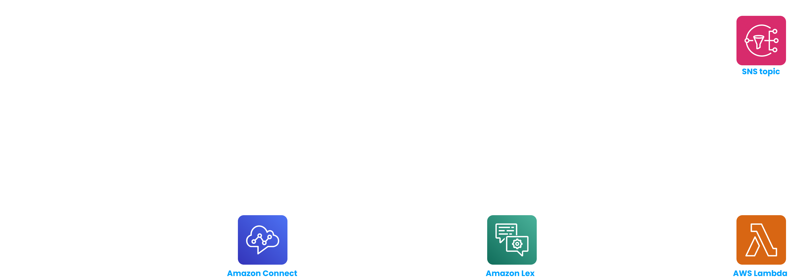
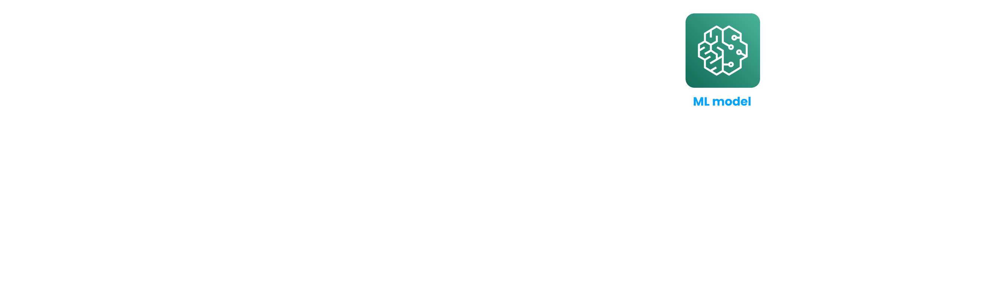
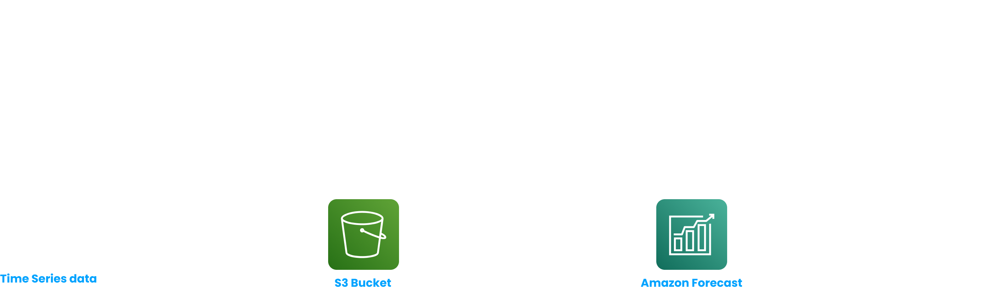
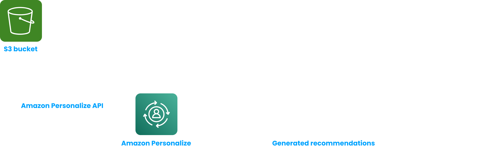

# Machine Learning Overview

- **Amazon Rekognition** -
    
    > **It is a service used to find people, objects, texts, scenes in images and videos using Machine Learning.**
    > 
    
     Some usecases are - labeling, face detection and analysis (gender, age range, emotions etc.), user verification using his / her face, celebrity recognition etc. It can do facial analysis and facial search to identify people and count the number of people. We can create a database of familiar faces or we can use the AWS maintained database containing celebrity faces.
    
    We can also do content moderation using Rekognition - detect inappropriate and offensive images and video. This feature can be used in social media, e-commerce applications to create a safe user experience. We first set a confidence level / threshold for Amazon Rekognition. For an image / video, if the confidence score is higher than the confidence level / threshold we set, then it is marked as inappropriate content. Optionally, we can use **Amazon Augmented AI** (**A2I**) to mark images / videos for manual review.
    
- **Amazon Transcribe** -
    
    > **It transcribes speech to text quickly and accurately using a Deep Learning process called Automatic Speech Recognition (ASR).**
    > 
    
    We can enable automatic censoring of Personal Identifiable Information (PII) (like someone’s name, age, phone number etc.) using Redaction. It also supports Automatic Language Identification for multi-lingual audio. Some usecases - automated video captions, metadata generation for videos to create a fully searchable video archive etc.
    
- **Amazon Polly** -
    
    > **It turns text to speech using Deep Learning.**
    > 
    
    We can customize the pronunciation of words with Pronunciation Lexicons. For example - we can tell Amazon Polly to pronounce St3ph4ne as *Stephane* 🙂 or AWS as *Amazon Web Services*. Amazon Polly also supports Speech Synthesis Markup Language (SSML). Using this we can add emphasis on words or phrases, breathing and whispering sounds etc.
    
- **Amazon Translate** - It is used to do language translation.
- **Amazon Lex and Connect** -
    
    **Amazon Lex** - It is the same technology that powers Amazon Alexa devices. It helps us in building chatbots and call center bots. It has built in Automatic Speech Recognition to convert speech to text and Natural Language Understanding to recognize the intent of user text / voice.
    
    **Amazon Connect** - It is a cloud based virtual contact center used to receive customer calls.
    
    
    
- **Amazon Comprehend** -
    
    > **It is a fully managed serverless service, which uses Natural Language Processing (NLP) to find insights and relationships in a piece of text.**
    > 
    
    It can extract key phases, events, people, brands etc. and perform sentiment analysis. It can also organize a collection of text files by topic.
    
    Amazon also provides a service called **Amazon Comprehend Medical**, which is used specifically in case of unstructured medical data.
    
- **AWS SageMaker** - It is a **fully managed service meant for developers and data scientists to develop Machine Learning models**. It helps with labeling data, building and training models, hyperparameter tuning and model deployment.
    
    
    
- **Amazon Forecast** - It is a fully managed Machine Learning service used to do highly accurate forecasts.
    
    
    
- **Amazon Kendra** - It is a Machine Learning powered, fully managed, document search service. It supports different document formats like PDF, text, Powerpoint etc. Content from these documents are first indexed and then the user can search something using Natural Language Processing (NLP). We can manually fine tune the search results if we want.
- **Amazon Personalize** - It is used to build real-time recommendation engines.
    
    
    
- **Amazon Textract** - It is used to extract text data from documents like PDFs, images etc. using AI and ML.