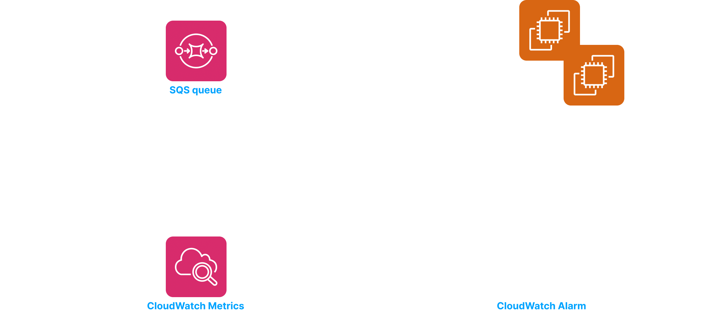
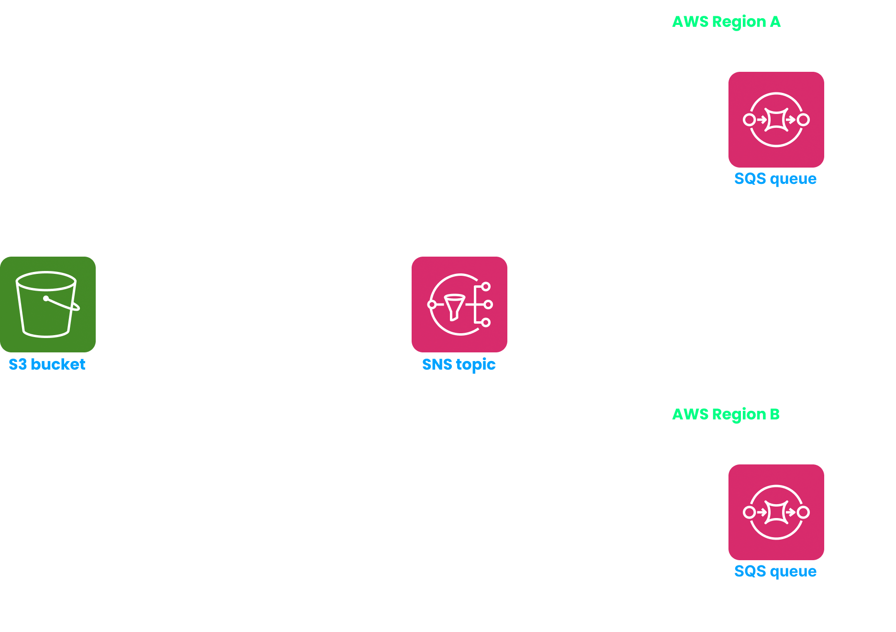
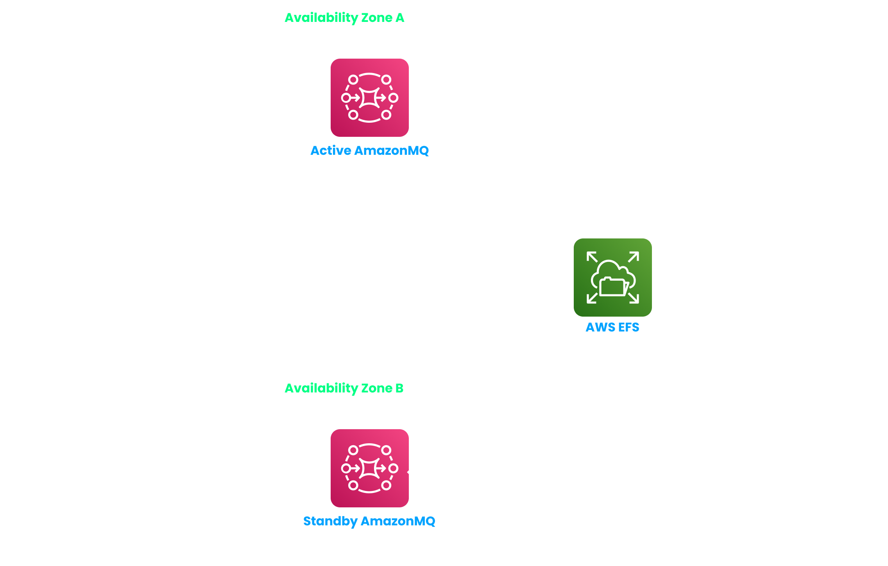
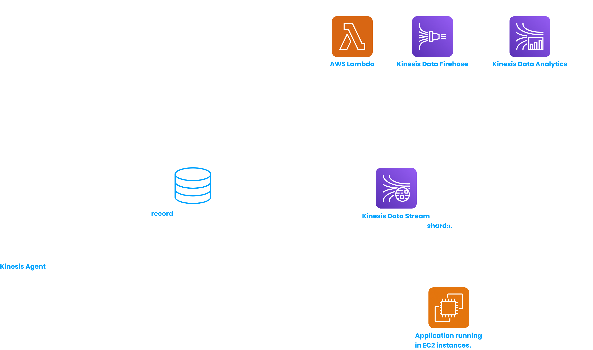
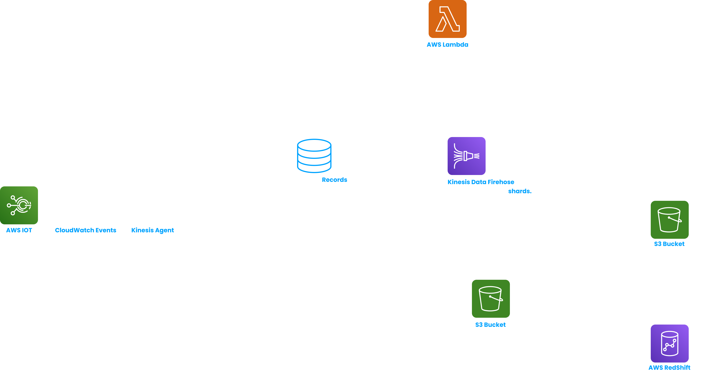

# SQS, SNS, AmazonMQ and Kinesis

## Simple Queue Service (SQS)

> **SQS is infinitely scalable (it can store unlimited number of messages and provides unlimited throughput). SQS has a very low latency regarding receiving or publishing messages (~ 10 ms). It supports AWS Lambda, AWS EC2 and on-premise servers.**
> 

<aside>
💡 The default retention period of a message in an SQS queue is 4 days. We can extend it to a maximum of 14 days. Size of each message must be < 256 KB.

</aside>

SQS is a pull based messaging system. A consumer needs to poll messages from an SQS queue. It can be either long polling or short polling. There can be message multiple producers and consumers at a time.

In case of long polling, the consumer waits between 1 - 20s for messages to arrive if there are currently no messages in the queue. Long polling settings can be configured at the queue level - consumers will long poll by default. Or a consumer can long poll explicitly by calling the *WaitTimeSeconds* API.

<aside>
💡 Databases like AWS Aurora or RDS have limited throughput. If there is a sudden spike of very high throughput traffic (more than the throughput that the database can handle) to the corresponding application, then database failures will occur. We can **place an SQS queue between the application and the database thus decoupling them**.

</aside>

SQS uses HTTPS, so we get encryption in flight. Encryption at rest can also be enabled for SQS messages. We can use SQS or KMS managed encryption. Security policies can be enforced on SQS resources using IAM or SQS policies.

<aside>
💡 Client-side encryption is not supported out of the box, but is doable.

</aside>

SQS supports 2 types of queues -

- **Standard** - Message ordering is not guaranteed (this is called **best offer ordering**). Standard queues offer atleast once message delivery.
    
    When a message is polled by a consumer from the queue, it becomes invisible to the remaining consumers for some period of time (called **message visibility timeout**) which defaults to 30s. We can set a custom value for message visibility timeout at the queue level. Or a consumer can increase the message visibility timeout for a specific message that it is processing, by calling the *changeMessageVisibility* API. After the message is processed, the consumer can delete it from the queue. In this way, we can prevent duplicate processing of the same message multiple times.
    
- **FIFO** - In this case message ordering is guaranteed. FIFO queues offer exactly once message delivery. We can also enable deduplication of messages.
    
    <aside>
    💡 FIFO queues are not infinitely scalable and have limited throughput - 300 messages/s without batching or 3000 messages/s with batching.
    
    </aside>
    
    We can have multiple groups in a FIFO based queue. But then, the producer needs to attach a group id with the message.
    

## Simple Notification Service (SNS)

> **SNS is a push based messaging system using the pub-sub architecture. A publisher publishes a message to an SNS topic and the message is then pushed to all the subscribers of that topic.**
> 

However unlike SQS, data is not persisted in SNS. If the message is not delivered successfully then it is lost forever.

<aside>
💡 You can have upto 100,000 topics in your AWS account (can be increased by contacting the AWS support team) and 12,500,000 subscribers for an SNS topic.

</aside>

Publishers and subscribers can interact with SNS using Topic Publish SDK (or Direct Publish SDK in case of mobile apps).

SNS can receive messages directly from lots of AWS services like CloudWatch Alarm, AWS budgets, Lambda, AutoScaling Group, S3 buckets, DynamoDB, RDS events, CloudFormation etc. SNS can directly send emails, mobile or SMS notifications. It can also publish messages to HTTP/HTTPS endpoints. It directly integrates with AWS SQS, AWS Lambda and KDF (Kinesis Data Firehose).

In terms of security, SNS is same as SQS. Other than IAM policies, we can also use SNS policies to control access to SNS resources. And similar to SQS, SNS also supports 2 types of queues - Standard and FIFO.

<aside>
💡 In case of an SNS FIFO queue, the only supported subscribers are SQS FIFO queues.

</aside>

Message filtering in SNS - A subscriber to an SNS topic receives all the messages in that topic, by default. But we can associate a JSON policy to the subscriber. Based on the parameters mentioned in that JSON policy, the subscriber will then receive not all but certain filtered messages from that SNS topic. (For example - **the SNS topic receives messages regarding all order related events. An SQS queue is subscribed to that topic and you want that queue to receive events from that SNS topic, only related to cancelled orders.**)

> **Fanout pattern - When we need to send a message to multiple SQS queues,** this pattern is used**. The message is first sent to an SNS topic. SNS then publishes that message to all the SQS queues which are subscribed to that SNS topic. The SQS queues can be in the same region as the SNS topic or it can be in different regions (cross region delivery).**
> 

<aside>
💡 A common usecase - When we want to send an S3 bucket event to multiple SQS queues (**an S3 bucket event is generated only once**).

</aside>

## AmazonMQ

In on-premise data centers we might use open protocols like MQTT, AMQP etc for messaging. When we shift our applications to AWS, we might not want to re-engineer our applications to make them work with SQS or SNS. For this purpose AWS provides a service called AmazonMQ (AWS managed RabbitMQ and ActiveMQ), which supports those open protocols. It supports both queues and topics.

<aside>
💡 AmazonMQ doesn’t scale like AWS SQS or SNS. Also since AmazonMQ runs on servers, the user can face server issues and failures. Also, we need to setup high-availability by ourselves.

</aside>

## AWS Kinesis

AWS Kinesis services are used to collect, process and analyze streaming data (like website click-streams, application logs and metrics etc.) at real time. Ordering of data in AWS Kinesis happens at shard level. AWS Kinesis work using both the pull based model (in **standard mode**) or the push based model (in **enhanced fan out mode**).

- **Kinesis Data Streams** (**used to capture and store data streams and send them for processing**)
    
    
    
    Data can be streamed by applications to AWS KDS using AWS SDK or KPL (Kinesis Producer Library). Or we can have a Kinesis Agent which will stream data (like application logs) on behalf of that application.
    
    > **The stream producer creates and sends records. A record is made of the data blob with size upto 1MB and the partition key which decides to which shard the record will go to. When a record is received by a shard in the KDS, a** **sequence number** (represents index of the message in the shard) **is attached to it**.
    > 
    
    The data received by KDS is retained for a certain period of time (1 - 365 days based on what the user wants). This gives KDS ability to replay / reprocess data Also, that data cannot be deleted from KDS before that period (this is why KDS is called immutable).
    
    Self managed consumers use AWS SDK or KCL (Kinesis Consumer Library) to consume data from KDS. But if we are using AWS Lambda, Kinesis Data Firehose or Kinesis Data Analytics, we will get out of the box integration with KDS for data consumption.
    
    We can use KDS in 2 modes -
    
    - **Provisioned mode** - We manage the number of shards manually or using API. The pricing model is based on /shard/hour.
        
        <aside>
        💡 **Incoming throughput** = 1 MB/s or 1000 messages/s/shard.
        **Outgoing throughput** = 2 MB/s/shard for overall consumers in shared consumption mode or 2 MB/s/shard/consumer in enhanced consumption mode.
        
        </aside>
        
    - **On-demand** (**serverless**) **mode** - Number of shards will be scaled automatically based on the throughput peak within last 30 days. Default incoming throughput in this case is 4 MB/s. The pricing model is based on /stream/hour and ingress and egress data throughput per GB.
    
    We can access KDS from an EC2 instance running inside a VPC using VPC Endpoint. The network traffic stays within AWS private network and doesn’t need to go through the public internet.
    
    We can control read / write access to shards using IAM policies. KDS uses HTTPS endpoints, so we get encryption at flight. Encryption at rest can be enabled by using KMS managed encryption. KDS also supports client-side encryption. API calls to KDS can be monitored using CloudTrail.
    
- **Kinesis Video Streams** (**AWS Kinesis Data Streams dedicated for Video Streams**)
- **Kinesis Data Firehose (used to load data streams into data stores)** -
    
    > **AWS KDF is a truely serverless AWS managed service, used to capture, optionally transform (using AWS Lambda) and then batch write data streams to compatible destinations. KDF supports many data formats and data compression.**
    > 
    
    
    
    Destinations can be of 3 types - AWS destinations (like AWS S3, Amazon Redshift, Amazon OpenSearch) or  3rd party AWS partner destinations (like DataDog, MongoDB etc.) or custom destinations (any API with HTTP endpoint).
    
    <aside>
    💡 In case of AWS RedShift as the destination, KDF first writes the data stream to an S3 bucket. Then that data is copied by KDF from the S3 bucket to AWS RedShift.
    
    </aside>
    
    Data publishing by KDF is near real time and not real-time (latency = ~60s) when data is published in non-full batches. Or KDF can wait till it has a full batch of size 1 MB and then publish the data.
    
    KDF can’t retain data like KDS. Thats’y, it doesn’t support data replay and immutability like KDS. We can store all data or data that was failed to publish to destinations in KDF, in a backup S3 bucket.
    
- **Kinesis Data Analytics (used to analyze data streams with SQL or Apache Flink)**